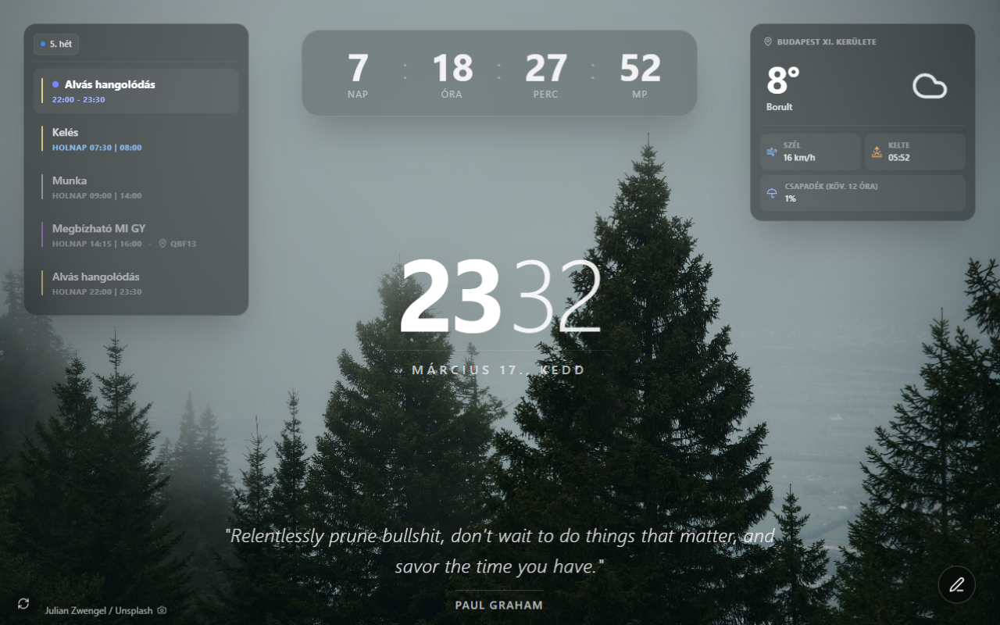

# Hub Dashboard Extension

A customizable new-tab dashboard built as a browser extension. It surfaces time, weather, top sites, a quick note, and a daily quote in a clean layout so you can start each session with the info you care about.

## Features

- Live clock and calendar
- Weather snapshot with icon mapping
- Quick note with daily storage
- Top sites list
- Daily quote widget
- Background info overlay

## Getting Started

1. Install dependencies:
   - `pnpm install`
2. Run the dev server:
   - `pnpm dev`
3. Build the extension:
   - `pnpm build`

## Preview

## Tech Stack

- React + TypeScript
- Vite
- Tailwind CSS
- CRXJS extension tooling
