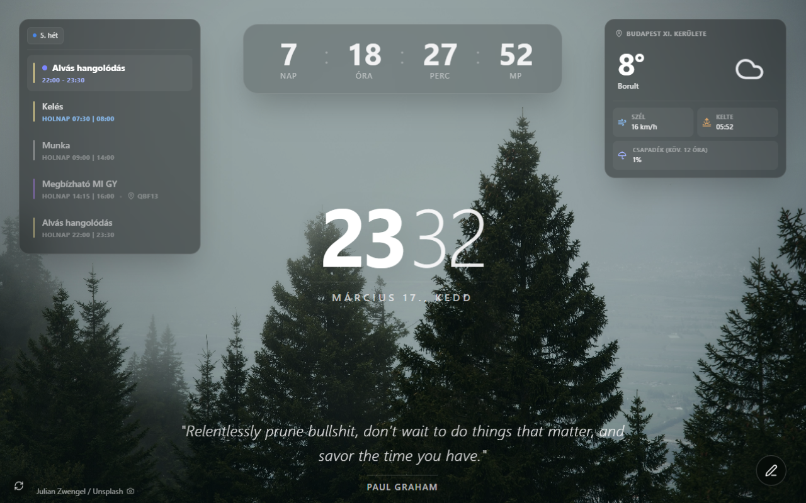

# Hub

A minimalist new tab dashboard for Chrome, with a serverless backend of its own.



Hub replaces the new tab page with the handful of things worth seeing when you
open one, laid over a daily Unsplash photograph — or your own image, if you
prefer. Everything is local: your notes, your calendar and your location never
leave the browser.

## What it shows

| Widget          | What it does                                                                     |
| --------------- | -------------------------------------------------------------------------------- |
| **Clock**       | Time and date                                                                     |
| **Weather**     | Current conditions and a four-day forecast, from your city or your location       |
| **Calendar**    | Upcoming Google Calendar events, from whichever calendars you pick                |
| **Quote**       | A daily Stoic quote                                                               |
| **Countdown**   | Time remaining to a date you set                                                  |
| **Focus timer** | A Pomodoro timer that runs in the background and notifies you at each phase       |
| **Quick note**  | A scratchpad that persists on the device                                          |

Every widget can be hidden from the popup, the background can be dimmed to taste,
and the whole overlay toggles away with `.` or a double-click when you just want
the photograph. Available in English and Hungarian.

The focus timer is worth a note: it lives in the extension's service worker, not
in the page, so one session is shared by every open tab and keeps running — and
keeps notifying you — with no tab open at all.

## Privacy

Hub collects nothing. No analytics, no account, no telemetry. Calendar events are
fetched into browser memory and never written to disk or sent anywhere; notes and
cached content stay on the device; preferences travel only through Chrome Sync.

The one server involved is the Hub API below, which exists so that an Unsplash key
does not have to ship inside the extension. It receives your background search
tags and nothing else.

Full detail: [Privacy Policy](https://csalex.in/hub-dashboard-extension/apps/extension/privacy-policy).

<!-- Absolute, not a relative `.md` link. GitHub Pages serves that file
     extensionless at the URL above and does not rewrite `.md` links to match,
     so a relative one reads fine in the repo and 404s on the published site —
     the copy the Chrome Web Store review and Google actually follow. -->


## Repository structure

This is an Nx monorepo.

```
hub/
├── apps/
│   ├── api/        # Cloudflare Worker (Hono.js) — background images and daily quotes
│   └── extension/  # Chrome extension (React 19 + Vite + CRXJS)
├── packages/
│   └── shared/     # Shared TypeScript types
├── assets/         # Images for this page and the Chrome Web Store listing
├── nx.json
├── package.json
└── pnpm-workspace.yaml
```

The API keeps the Unsplash credentials server-side and caches both endpoints in
Cloudflare KV — an image pool per tag set, and the daily quote by date — so
upstream is hit far less than once per user.

## Prerequisites

- Node.js >= 20
- pnpm >= 10

## Setup

```bash
pnpm install
```

## Development

Run each app from its own directory — see individual READMEs:

- [apps/api/README.md](apps/api/README.md)
- [apps/extension/README.md](apps/extension/README.md)

Workspace-wide tasks run through Nx and are cached:

| Command          | Description                                             |
| ---------------- | ------------------------------------------------------- |
| `pnpm typecheck` | TypeScript check across all projects                    |
| `pnpm lint`      | ESLint across all projects                              |
| `pnpm test`      | Vitest across all projects                              |
| `pnpm check`     | typecheck + lint + test                                 |
| `pnpm build`     | Production build of every buildable project             |
| `pnpm affected`  | The same targets, limited to projects changed vs `main` |

Husky runs `check` before each commit and `build` before each push; CI
([`check.yml`](.github/workflows/check.yml)) repeats them on every pull request
and on `main`.

## Releases

Both apps version independently using git tags. Pushing a tag triggers the
corresponding GitHub Actions deployment.

| App       | Tag pattern   | Example            |
| --------- | ------------- | ------------------ |
| API       | `api@*`       | `api@1.1.0`        |
| Extension | `extension@*` | `extension@2.3.0`  |

Nx manages versioning with conventional commits and generates GitHub changelogs
automatically, so tags are normally created by the release workflow rather than
by hand.

## Commit conventions

This repo uses [Conventional Commits](https://www.conventionalcommits.org/).
Husky enforces this via commitlint on every commit.

```
feat(extension): add countdown widget
fix(api): handle empty Unsplash response
chore(release): publish
```

## License

[MIT](LICENSE)
