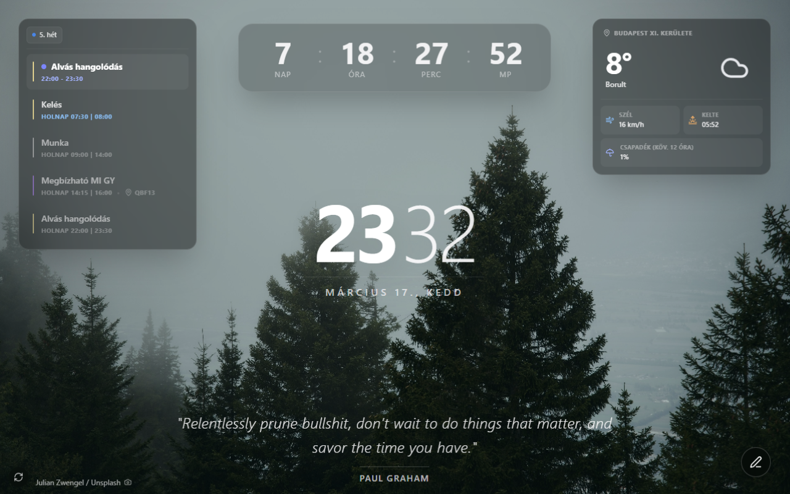

<h1> Hub Extension</h1>

A Chrome extension that replaces the new tab page with a minimalist dashboard. Shows time, weather, upcoming Google Calendar events, a daily Stoic quote, a countdown timer, and a quick note — all over a full-screen Unsplash background.

## Features

- **Clock** — current time and date with a time-of-day greeting
- **Weather** — temperature, wind, rain probability, sunrise/sunset via [Open-Meteo](https://open-meteo.com/)
- **Calendar** — next upcoming Google Calendar events (read-only OAuth)
- **Quote** — daily Stoic quote, cached per day
- **Countdown** — custom target date configurable from settings
- **Quick note** — per-day scratchpad, stored locally
- **Background** — random Unsplash photo fetched from the Hub API, cached daily

Double-click anywhere to toggle the UI overlay on/off.

## Preview



## Local development

### 1. Install dependencies

From the monorepo root:

```bash
pnpm install
```

### 2. Configure environment variables

Create `apps/extension/.env`:

```
VITE_DEV_CLIENT_ID=your_google_oauth_client_id
```

- **Google OAuth client ID**: [console.cloud.google.com](https://console.cloud.google.com) → create an OAuth 2.0 Client ID for a Chrome Extension

### 3. Start the dev server

```bash
cd apps/extension
pnpm dev
# Dev server at http://localhost:5173
```

> **Note:** The Vite dev server is useful for iterating on UI. To test as an actual new tab override, load the built extension in Chrome (see below).

### 4. Load in Chrome as an unpacked extension

```bash
pnpm build          # Outputs to dist/
```

1. Open `chrome://extensions`
2. Enable **Developer mode** (top right)
3. Click **Load unpacked**
4. Select the `apps/extension/dist/` folder
5. Open a new tab

After code changes, run `pnpm build` again and click the refresh icon on the extension card in `chrome://extensions`.

## Scripts

| Command      | Description                                      |
| ------------ | ------------------------------------------------ |
| `pnpm dev`   | Start Vite dev server at `http://localhost:5173` |
| `pnpm build` | Type-check + production build → `dist/`          |
| `pnpm pack`  | Build and zip `dist/` → `extension-release.zip`  |
| `pnpm lint`  | Run ESLint                                       |

## Deployment

The extension deploys to the Chrome Web Store via GitHub Actions on every `extension@*` tag push.

### Automated deployment (GitHub Actions)

1. Add these secrets to your GitHub repository:
   - `EXTENSION_ID` — Chrome Web Store extension ID (from the store URL)
   - `CLIENT_ID` — Google OAuth client ID (for Web Store API)
   - `CLIENT_SECRET` — Google OAuth client secret
   - `REFRESH_TOKEN` — Google OAuth refresh token

2. Push a version tag:
   ```bash
   git tag extension@2.0.1
   git push origin extension@2.0.1
   ```

GitHub Actions runs `.github/workflows/deploy.yml`, which builds with `pnpm nx run extension:pack` (produces `extension-release.zip`) and uploads to the Chrome Web Store.

### Manual submission

```bash
pnpm pack
# Creates extension-release.zip from dist/
```

Upload `extension-release.zip` manually at [chrome.google.com/webstore/devconsole](https://chrome.google.com/webstore/devconsole).

## Settings

Click the extension icon to open the settings popup:

| Setting          | Description                              |
| ---------------- | ---------------------------------------- |
| Background tags  | Comma-separated Unsplash search tags     |
| Location         | City name or auto-detect via GPS or IP   |
| Calendars        | Select which Google Calendars to display |
| Countdown target | Date to count down to                    |

Settings sync across devices via Chrome Storage Sync.

## Permissions

| Permission    | Reason                                   |
| ------------- | ---------------------------------------- |
| `storage`     | Persist settings via Chrome Storage Sync |
| `geolocation` | Auto-detect location for weather         |
| `identity`    | Google Calendar OAuth login              |

## Stack

| Tool                                       | Purpose                      |
| ------------------------------------------ | ---------------------------- |
| [React 19](https://react.dev/)             | UI framework                 |
| [Vite 7](https://vitejs.dev/)              | Build tool and dev server    |
| [CRXJS](https://crxjs.dev/vite-plugin)     | Chrome extension Vite plugin |
| [Tailwind CSS 4](https://tailwindcss.com/) | Styling                      |
| [Lucide React](https://lucide.dev/)        | Icons                        |
| [date-fns](https://date-fns.org/)          | Date formatting              |
| TypeScript                                 | Language                     |

## External APIs

| API                                             | Used for           | Auth             |
| ----------------------------------------------- | ------------------ | ---------------- |
| [Open-Meteo](https://open-meteo.com/)           | Weather data       | None (free)      |
| [BigDataCloud](https://www.bigdatacloud.com/)   | Reverse geocoding  | None (free tier) |
| Hub API (`apps/api`)                            | Background images  | None             |
| [stoic.tekloon.net](https://stoic.tekloon.net/) | Daily Stoic quotes | None             |
| Google Calendar API                             | Calendar events    | OAuth 2.0        |

## Privacy policy

See [privacy-policy.md](./privacy-policy.md).

